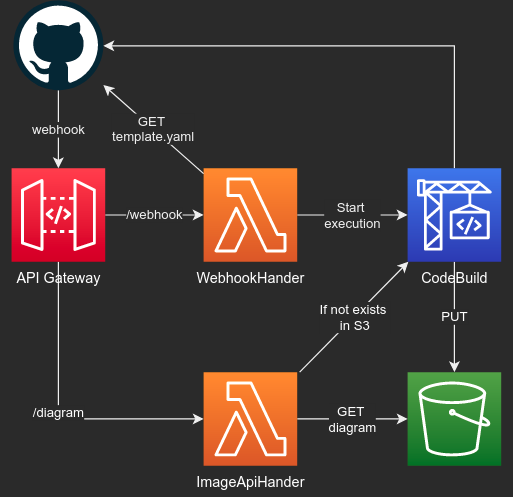

# cfn-diagram-github

Sample project that creates a badge-like URL for displaying an auto generated and always up-to-date diagram of your CloudFormation/SAM template in your blog or README-file.

This uses [cfn-diagram](https://github.com/mhlabs/cfn-diagram) along with [pageres](https://github.com/sindresorhus/pageres) to generate a screenshot using headless chrome.

## Setup

1. Install this [SAM application](url here) from the Serverless Application Repository
2. When prompted, enter your [GitHub token](https://docs.github.com/en/free-pro-team@latest/github/authenticating-to-github/creating-a-personal-access-token), your GitHub organistaion/user and the secret key (could be any string). Take note of the secret for step 4
3. After installed, take note of the `DiagramUrl` and `WebhookUrl` values in the outputs section. I.e 'https://a1b2c3d4e5.execute-api.eu-west-1.amazonaws.com/diagram'
4. Go to your GitHub account and [set up a webhook](https://developer.github.com/webhooks/creating/) on all push events. The endpoint URL should be the value of `WebhookUrl` in step 3. Set the secret to be the same as in step 2. This is to prevent unauthorised access to your endpoint.

## Embedding diagram in GitHub README:

Use the `DiagramUrl` form the outputs section in step 3.
```

```
If you set `branch` to 'coalesce' it will render the first generated diagram it can find in the following ordered list of branches: [master, main, develop]. See known issues for reason why.

Note that the first time you request a diagram for a repo it will take a couple of minutes to create it during which time the image will be empty. This is because the headless chrome that takes the screenshot is run in CodeBuild where the provisioning can take some time.

NOTE that the URL is, although hard to guess, public by default. You can extend this with a WAF protection if needed.

## Architecture


## Known issues / assumptions
* The code will look for template files from the following list of file names: `['template.yaml', 'template.yml', 'template.json', 'sam.yaml', 'sam.yml', 'sam.json', 'serverless.template']`. 
* It assumes that you have one template in your repo. If not - it will use the one matching the filename list that is in or closest to the root folder
* GitHub doens't have the feature of branch name placeholders in its markdown, so when referencing a diagram we can't know what branch the user is viewing. Typically you'll want to display what's in master/main, but you might want to see the work in progress during the eraly development. To do this you can use the `&branch=coalesce` query string argument. This will use the diagram from master/main _if there is one_, otherwise it will show develop.


